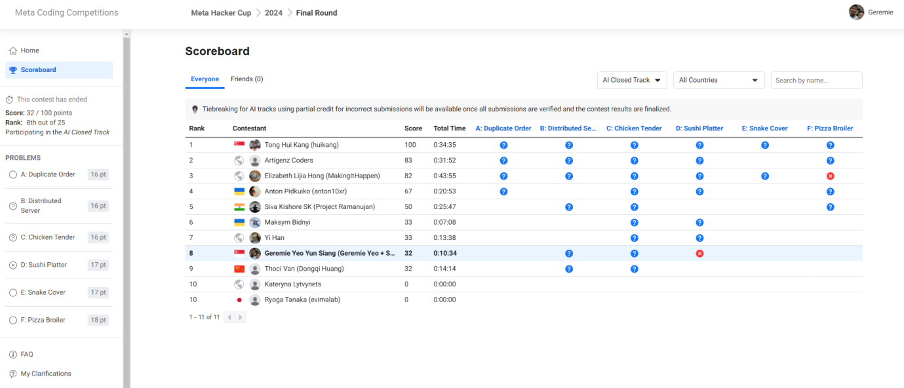
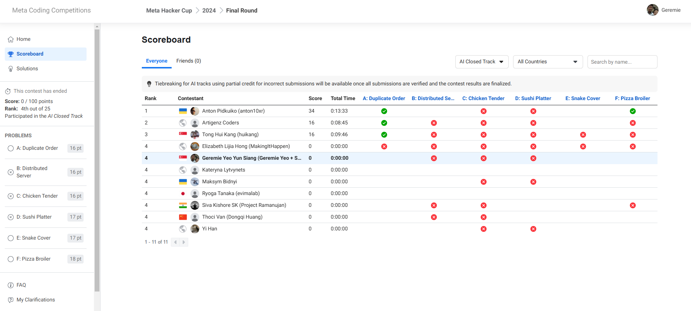

# Chain-of-Problem-Solving: Multi-step agent to solve Meta Hackercup problems

This repository provides our code and approach in the **final round** of the Meta Hackercup 2024 competition

# Approach
The idea here is to simulate how humans think when solving a **competitive programming** problem

Usually, solving a problem adheres to the following steps:
1. Read the problem, understand the input and output
2. Figure out the expected time complexity
3. Create a mental model on how to solve the problem by doing mathematical reasoning using pen-and-paper
4. Think of ways to optimize the brute force to fit into (2)
5. Write the code to solve the problem based on (3)
6. Submit to the competition website and receive a verdict (Accepted, Time Limit Exceeded, Wrong Answer)
7. Refine the solution based on the given verdict if it is incorrect. If TLE, optimize the solution. If WA, analyze where went wrong and think of different approaches to fix the mistake

This pipeline's approach aims to mimic the step-by-step approach on how humans approach a competitive programming problem
1. Think of the time complexity
2. Review the time complexity
3. Think of the relevant concepts
4. Review the relevant concepts
5. Generate an initial solution
6. Review the time complexity of the initial solution
7. Review the correctness of the initial solution
8. Generate a new solution based on 6 and 7
9. Repeat 6, 7, 8
10. Output the final code and run on the test set

# To run the code
1. Create an .env file with the following lines
```
OPENAI_API_KEY=<YOUR OPENAI_API_KEY>
```

2.
```
pip install -r requirements.txt
```

3. Run the following command (change the parameters if needed)
```
python run.py --model o1-mini-2024-09-12 --max_attempts 3 --num_time_complexity_tries 4 --num_concepts_tries 2 --problem_name '"Duplicate Order"'
```
It will take about 5-20 mins to execute depending on the given problem
**NOTE:** The problem has to be placed in the /problems/(Your Problem Name) folder with files
- full_in.txt (full input)
- sample_in.txt (sample input)
- sample_out.txt (sample output)
- statement.txt (problem statement)
- relevant images where applicable

4. Check the output files in the directory associated with the model ((PROBLEM NAME)_output.text and (PROBLEM NAME)_code.py)

# Things we have not tried but may look promising
- Generating random stress tests to feed into the LLM for debugging

# Things we have tried but failed
- RAG
- Matching answers to sample test cases (some examples have more than one correct answer so this is not feasible)
- Publicly available agentic frameworks (Rethink-MCTS and Mapcoder) - these significantly increased the required time to solve the problem with not much greater accuracy. In the final round, none of the problems ran on the pipeline with these additional frameworks within 10 mins.

# Team members
- Geremie Yeo (Leader)
- Saidinesh Pola
Total score across **all rounds**: 25.5

